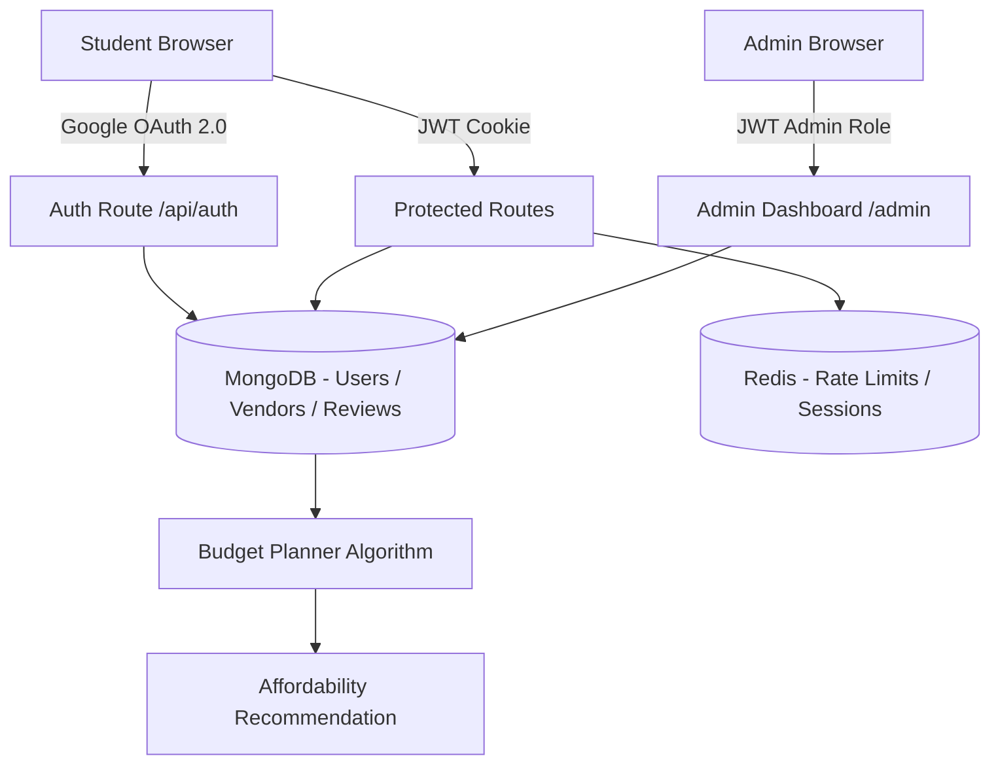

# Campus Dining & Vendor Quality Management System

> **Course:** Software Engineering & Management  
> **Submitted to:** Dr. Sonali Mondal  
> **University:** SRM University AP, Amaravati, Andhra Pradesh  
> **GitHub:** [mbapukoushik/campus-dining-system](https://github.com/mbapukoushik/campus-dining-system)

---

## Overview

A full-stack web application for managing campus dining vendors, student reviews, and group budget planning at SRM University AP. Built with **Node.js + Express** (backend), **React + Vite** (frontend), **MongoDB**, and **Redis**.

The system features Google OAuth authentication restricted to `@srmap.edu.in` accounts, a rate-limited and anomaly-detecting review system, a median-price-based budget planning algorithm, and a real-time Admin Mission Control dashboard.

---

## Architecture



---

## Key Features

| Feature | Description |
|---|---|
| 🔐 Google OAuth | Domain-restricted login (`@srmap.edu.in` only), JWT cookie session |
| 📊 Vendor Dashboard | Browse real Mangalagiri/Amaravati restaurants with ratings, wait times, photos |
| ⭐ Review System | 3-score rating (Taste / Value / Overall), 1 review per vendor per student (lifetime) |
| 🛡️ Anomaly Tripwire | Auto-freezes vendors with >10 negative reviews in 60 min (TDD §6.4) |
| 💰 Budget Planner | Median-price algorithm returns `Highly Recommended` or `Some Options Available` |
| 🛠️ Admin Dashboard | Open/close vendors, platform-wide statistics, role-based access |

---

## Budget Planner Algorithm (TDD §2.2)

```
per_person_budget  = total_budget / headcount
items_in_category  = MenuItem WHERE category == input AND is_sold_out == false
items_within_budget = items_in_category WHERE price <= per_person_budget
median_price       = median(items_in_category.prices)

IF (items_within_budget / items_in_category >= 0.50) AND (median_price <= per_person_budget)
   recommendation = "Highly Recommended"
ELSE
   recommendation = "Some Options Available"

IF MIN(items_in_category.price) > per_person_budget
   max_spend_warning = true
```

---

## Tech Stack

| Layer | Technology |
|---|---|
| Backend | Node.js 20, Express 4, Passport.js |
| Database | MongoDB 7.0 (Docker), Mongoose ODM |
| Cache / Rate Limiting | Redis (Docker), ioredis |
| Frontend | React 18, Vite, React Router v6 |
| Auth | Google OAuth 2.0, JWT (httpOnly cookie) |
| Testing | Jest 29 |
| Infrastructure | Docker Compose |

---

## Vendors (Real Mangalagiri / Amaravati Restaurants)

| Vendor | Location | Rating |
|---|---|---|
| Bismillah Biryani | Opp Mandakini Bar | ⭐ 4.2 |
| Sri Lakshmi Mourya Dhaba | Near Donbasco School, Yerrabai Nagar | ⭐ 4.1 |
| Mandakini Restaurant | Gowtham Buddha Road | ⭐ 3.9 |
| Zam Zam Family Restaurant | Gowtham Buddha Road | ⭐ 3.9 |
| Senapathi Military Hotel | Guntur Highway, Chinakakani | ⭐ 3.8 |
| Prasad Fast Foods & Biryanis | Near VJ College, Ganapathi Nagar | ⭐ 3.2 |

---

## Setup & Running Locally

### Prerequisites
- Docker Desktop (running)
- Node.js ≥ 20
- npm ≥ 9

### Step 1 — Start Infrastructure
```bash
docker compose up -d
```
This starts MongoDB (port 27017) and Redis (port 6379).

### Step 2 — Configure Environment
```bash
cp backend/.env.example backend/.env
# Edit backend/.env and fill in GOOGLE_CLIENT_ID and GOOGLE_CLIENT_SECRET
```

### Step 3 — Install Dependencies
```bash
cd backend && npm install
cd ../frontend && npm install
```

### Step 4 — Seed the Database
```bash
cd backend && npm run seed
```

### Step 5 — Run
```bash
# Terminal 1
cd backend && npm run dev

# Terminal 2
cd frontend && npm run dev
```

Open `http://localhost:5173` and sign in with your `@srmap.edu.in` Google account.

---

## Running Tests
```bash
cd backend && npm test
```
**8 tests passing** — covers the Budget Planner affordability algorithm (5 tests) and the Anti-Weaponization subnet gate (3 tests).

---

## Security Design (TDD §6.x)

- **Rate Limiting**: Redis sliding window — max 2 reviews/hour per student, 1 review per vendor lifetime
- **Anomaly Tripwire**: >10 negative reviews (score ≤ 2) in 60 minutes triggers vendor freeze
- **Anti-Weaponization**: Account age gate (>7 days), subnet gate (≤3 /24 subnets), prior activity gate
- **JWT**: `httpOnly`, `sameSite: strict` cookie — no `localStorage` token storage
- **Role Guard**: `student`, `vendor`, `admin` — all protected routes verified server-side

---

## Database Schema

| Collection | Key Fields |
|---|---|
| `users` | UUID _id, email, role, is_verified, created_at |
| `vendors` | UUID _id, owner_id, stall_name, location_tag, operating_hours, avg_rating, wait_time |
| `menu_items` | UUID _id, vendor_id, item_name, price, category, dietary_tag, is_sold_out |
| `reviews` | UUID _id, vendor_id, student_id, taste_score, value_score, overall_score, is_frozen |
| `audit_logs` | UUID _id, admin_id, action, target_id, reason, timestamp |
